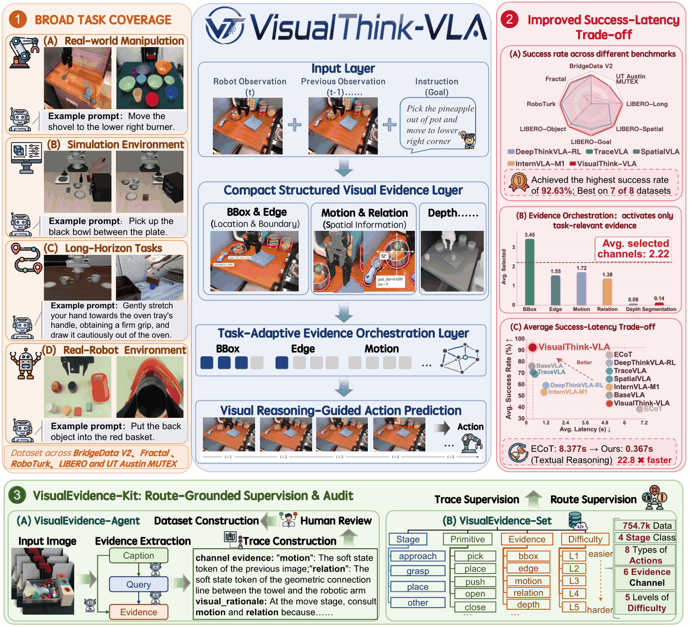
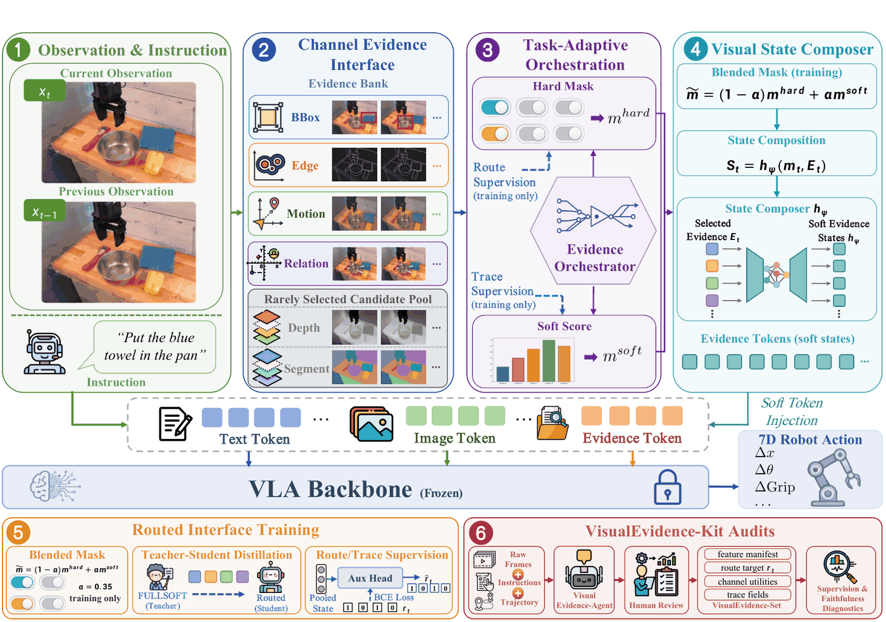
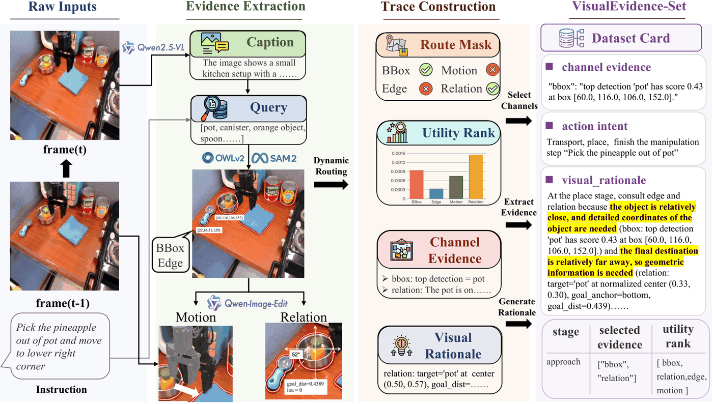
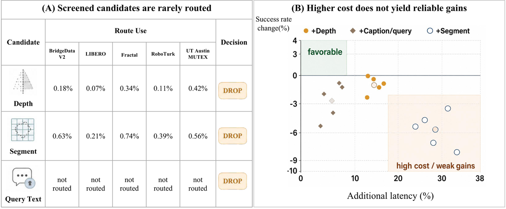
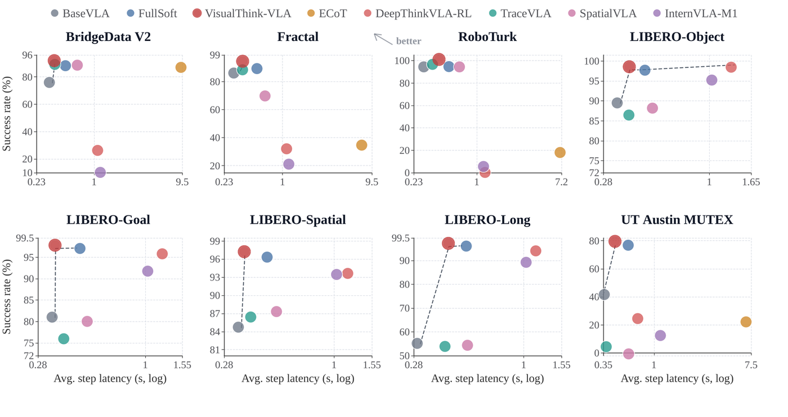
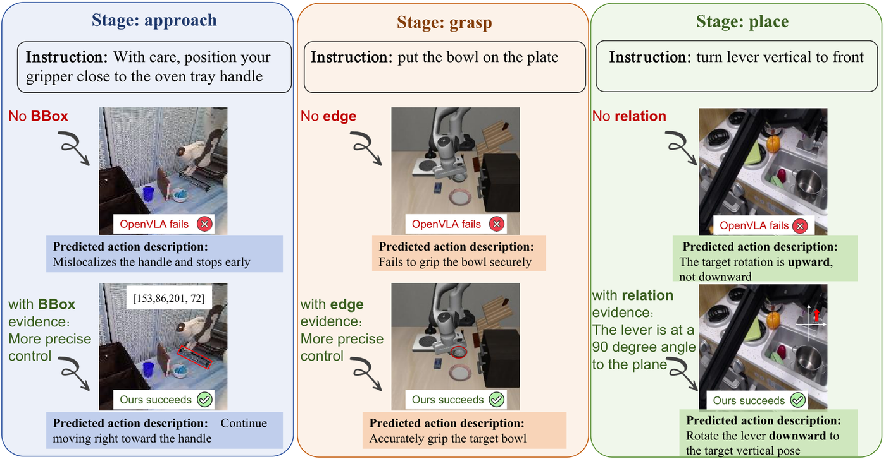

<div align="center">
  
</div>

<p align="center">
  <b>Visual Intermediate
Reasoning for Effective and Low-Latency
Vision-Language-Action Policies</b>
</p>

<p align="center">
  <a href="#installation"></a>
  <a href="#quick-start"></a>
  <a href="#visualevidence-set"></a>
  <a href="#citation"></a>
</p>

<p align="center">
  <a href="#overview">Overview</a> | 
  <a href="#installation">Installation</a> | 
  <a href="#quick-start">Quick Start</a> | 
  <a href="#evaluation">Evaluation</a> | 
  <a href="#citation">Citation</a>
</p>

<div align="center">
  
</div>

## News

- **2026-05**: Initial public code skeleton for VisualThink-VLA, including evidence extraction, router training, adapter training, VisualEvidence-Set construction, and evaluation scripts.

## Overview

VisualThink-VLA is a routed visual-evidence interface for vision-language-action policies. It keeps the base VLA frozen, extracts compact visual evidence from robot observations, and routes only the evidence channels needed for the current manipulation step.

The repository contains the main research pipeline:

- structured visual evidence extraction from robot observations;
- evidence router training over `bbox`, `edge`, `motion`, and `relation`;
- `FullSoft` and `VisualThink-VLA` evidence-token adapter training on OpenVLA-style policies;
- VisualEvidence-Set construction and governance for supervision and audit;
- offline, LIBERO closed-loop, faithfulness, and success-latency evaluation scripts.

<div align="center">
  
</div>

## Highlights

- **Routed visual thinking.** VisualThink-VLA uses compact evidence tokens instead of injecting long prompt-text rationales into the policy.
- **Four operational channels.** The deployed evidence bank uses `bbox`, `edge`, `motion`, and `relation` for localization, boundary geometry, temporal change, and language-grounded spatial layout.
- **Frozen VLA backbone.** The base policy remains frozen; VisualThink-VLA trains lightweight evidence and routing modules around it.
- **Auditable supervision.** VisualEvidence-Kit builds VisualEvidence-Set records with route masks, selected evidence, counterfactual utilities, and channel-grounded rationales.

## VisualEvidence-Kit

VisualEvidence-Kit converts robot trajectories into route-grounded supervision and audit records. The generated VisualEvidence-Set supports router training, trace-supervised adapter refinement, and faithfulness diagnostics.

<div align="center">
  
</div>

## Channel Screening

The code keeps the default deployed channel set compact. Depth and segmentation can be extracted for screening or diagnostics, but they are not part of the default operational interface.

<div align="center">
  
</div>

## Installation

```bash
conda create -n visualthink-vla python=3.10 -y
conda activate visualthink-vla
pip install -r requirements.txt
pip install -e .
```

OpenVLA/Prismatic, LIBERO, SAM2, and local perception checkpoints are optional runtime dependencies for the corresponding training and evaluation paths. Keep checkpoints, datasets, generated features, and logs outside this repository and pass their paths through command-line arguments.

## Quick Start

### 1. Extract Visual Evidence

Run the evidence pipeline on one image and instruction:

```bash
python scripts/extract_visual_evidence.py \
  --image_path path/to/current.png \
  --prev_image_path path/to/previous.png \
  --instruction "pick up the red bowl" \
  --output_dir outputs/evidence_one
```

Batch extraction from a frame manifest:

```bash
python scripts/batch_extract_visual_evidence.py \
  --manifest data/frame_manifest.jsonl \
  --output_dir outputs/features
```

### 2. Train The Evidence Router

```bash
python scripts/train_evidence_router.py \
  --feature_manifest outputs/features/feature_manifest.jsonl \
  --config configs/evidence_router.yaml \
  --output_dir outputs/router
```

### 3. Train FullSoft And VisualThink-VLA

Train the dense four-channel `FullSoft` teacher adapter:

```bash
python scripts/train_visualthink_adapter.py \
  --mode full \
  --feature_manifest outputs/features/feature_manifest.jsonl \
  --model_path path/to/openvla \
  --config configs/visualthink_adapter.yaml \
  --output_dir outputs/fullsoft
```

Train the routed `VisualThink-VLA` adapter:

```bash
python scripts/train_visualthink_adapter.py \
  --mode visualthink \
  --feature_manifest outputs/features/feature_manifest.jsonl \
  --model_path path/to/openvla \
  --config configs/visualthink_adapter.yaml \
  --gate_checkpoint_dir outputs/router \
  --teacher_adapter_dir outputs/fullsoft \
  --output_dir outputs/visualthink
```

### 4. Build VisualEvidence-Set

```bash
python scripts/build_visualevidence_set.py \
  --feature_manifest outputs/features/feature_manifest.jsonl \
  --gate_checkpoint_dir outputs/router \
  --visualthink_checkpoint_dir outputs/visualthink \
  --output_path outputs/visualevidence/visualevidence_set.jsonl

python scripts/govern_visualevidence_set.py \
  --input_trace outputs/visualevidence/visualevidence_set.jsonl \
  --output_dir outputs/visualevidence/governed
```

## Evaluation

Offline action-prediction benchmark:

```bash
python scripts/evaluate_offline.py \
  --feature_manifest outputs/features/feature_manifest.jsonl \
  --model_path path/to/openvla \
  --full_checkpoint_dir outputs/fullsoft \
  --visualthink_checkpoint_dir outputs/visualthink \
  --output_dir outputs/eval_offline
```

Faithfulness audit:

```bash
python scripts/audit_faithfulness.py \
  --feature_manifest outputs/features/feature_manifest.jsonl \
  --model_path path/to/openvla \
  --visualthink_checkpoint_dir outputs/visualthink \
  --evidence_trace_manifest outputs/visualevidence/visualevidence_set.jsonl \
  --output_dir outputs/audit
```

Success-latency visualization:

```bash
python scripts/plot_success_latency_tradeoff.py \
  --report_path outputs/main_results.md \
  --out_pdf outputs/figures/success_latency.pdf \
  --out_png outputs/figures/success_latency.png
```

<div align="center">
  
</div>

## Qualitative Examples

VisualThink-VLA routes different evidence channels according to the current manipulation demand, such as relation evidence for pose-sensitive control, edge evidence for contact geometry, and bbox evidence for target localization.

<div align="center">
  
</div>

## Model And Data Assets

This repository intentionally excludes large assets. The following should be stored outside the Git repository:

- OpenVLA or other VLA checkpoints;
- perception backbones and local model caches;
- raw robot datasets and generated feature manifests;
- trained router or adapter checkpoints;
- evaluation logs, generated figures, and run artifacts.

The `.gitignore` is configured to keep these files out of the repository by default.

## Citation

If you find this repository useful, please cite:

```bibtex
@article{visualthinkvla2026,
  title   = {VisualThink-VLA: Routed Visual Evidence for Vision-Language-Action Policies},
  author  = {VisualThink-VLA Authors},
  journal = {arXiv preprint},
  year    = {2026}
}
```

## Acknowledgement

This code builds on the broader OpenVLA, LIBERO, SAM2, and vision-language modeling ecosystems. We thank the authors of these projects for making their research artifacts available.
